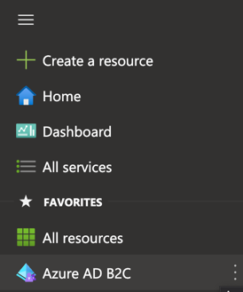

# blazor-api-aadb2c
Sign in users and call a protected API from a Blazor Server app using Azure AD B2C as the authorization server.
It's an example of Authorization Code Flow.
Read more about it [here](https://auth0.com/docs/get-started/authentication-and-authorization-flow/which-oauth-2-0-flow-should-i-use).
In this example, I'm using Azure AD B2C in place of Auth0 (shown in the diagram below). The diagram is taken from Auth0 docs.

In this flow we get ID token and Access token from the authorization server. We use Access Token to call the protected API.
Also helpful to know is the difference between ID token and Access token. Read all about it [here](https://auth0.com/blog/id-token-access-token-what-is-the-difference/).

### Choosing right auth library
We'll be using `Microsoft.Identity.Web` based on this flowchart.

Read more about it [here](https://learn.microsoft.com/en-us/entra/msal/dotnet/getting-started/choosing-msal-dotnet).

### Create B2C tenant
Create a new Azure AD B2C tenant in your subscription (if you don't already have one).
Before my app can interact with Azure AD B2C, it must be registered in a tenant that I manage.

Create an Azure AD B2C tenant. Instructions [here](https://learn.microsoft.com/en-us/azure/active-directory-b2c/tutorial-create-tenant?WT.mc_id=Portal-Microsoft_AAD_B2CAdmin).

1. Switch to this new directory that you just created.
   Add this to favorites.
   Search for Azure AD B2C and click on the star to make it appear under favorites.
   

2. Now it'll show up like this:

   

### Register Web App in Azure AD B2C
1. Register a Web App. Instructions [here](https://learn.microsoft.com/en-us/azure/active-directory-b2c/tutorial-register-applications?tabs=app-reg-ga).

2. Enable ID token and Access token

   

3. Create User Flows for Signup, SignIn, Reset password and Edit profile. Instructions [here](https://learn.microsoft.com/en-us/azure/active-directory-b2c/tutorial-create-user-flows?pivots=b2c-user-flow).

### Register Web API in Azure AD B2C
1. App Registration -> New Registration.

   
   
   Record the client Id.

2. Configure Web API scopes. Do a bit of reading [here](https://auth0.com/blog/permissions-privileges-and-scopes/) first.

3. Expose an API -> Application ID URI -> Add -> Change the GUID to more human readable text like: _munson-api_.

   

4. Add Scopes: _read_ and _write_.

   

5. Copy those scope names:
`https://munsonpickles3.onmicrosoft.com/munson-api/read` and
`https://munsonpickles3.onmicrosoft.com/munson-api/write`

6. Grant the web app permissions for the Web API.
App Registrations -> Munson Web -> API Permissions -> Add a permission
Go to -> APIs my organization uses -> Munson API (This is the API to which the web app should be granted access) -> Select Permissions: read and write -> Add permissions

7. Select "Grant admin consent for <your tenant name>. (Munson Pickles is my Tenant/ Directory name.)

8. Now my Web App has permissions to call Microsoft Graph and Web API as shown below:

Whenever the Client Blazor Server app calls the API, the logged in user will grant "read" access to the Blazor Server app which will present that scope to the backend API which is protected by a policy that requires "read" scope.

### Create a new API project
Use command line or Rider or Visual Studio for this.

### Setup the API project to use Azure AD B2C
1. Add required packages
`Microsoft.Identity.Web`
`Microsoft.AspNetCore.Authentication.OpenIdConnect`
`Microsoft.AspNetCore.Authentication.JwtBearer`
2. [Reference](https://jamescook.dev/azure-b2c-getting-started).

### Setup the Web App project to use Azure AD B2C
1. Add required packages
   `Microsoft.Identity.Web`
   `Microsoft.Identity.Web.UI`
   `Microsoft.Identity.Web.DownstreamApi`
   `Microsoft.AspNetCore.Authentication.OpenIdConnect`
   `Microsoft.AspNetCore.Authentication.JwtBearer`
`Microsoft.Identity.Web` sets up the authentication pipeline with cookie based auth.
Takes care of sending and receiving HTTP authentication messages, token validation, claims extraction and more.

2. [Reference](https://learn.microsoft.com/en-us/azure/active-directory-b2c/enable-authentication-web-application?tabs=visual-studio).

### Jump into the code to see how the client calls the protected API 🎉
[Reference](https://learn.microsoft.com/en-us/azure/active-directory/develop/scenario-web-app-call-api-app-configuration?tabs=aspnetcore)